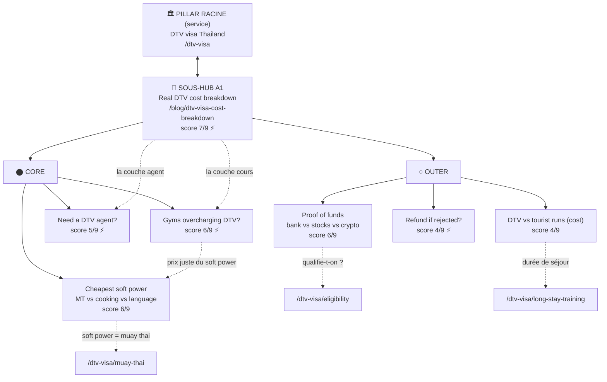

# Topical Map : DTV visa Thailand — le vrai coût & les pièges d'argent

> Généré le 2026-07-03. Cluster de **7 articles blog** : 0 existants, 7 à créer.
> Marché : nomades/expats DTV, EN-first (monde entier). Source de vérité : ce fichier.
> **Mode : `deepen`** de l'axe *coût* — le pillar racine est le silo service existant `/dtv-visa`.
> Les 7 articles sont des **spokes blog** (catégorie `visa`) qui **remontent** vers le silo,
> ils ne créent PAS de nouvelle page pillar.
>
> Matière : `docs/reddit-insights/price-dtv-thailand-2026-06-08.md` (646 blocs, 11 thèmes).
> Data volumes : `.seo-data/keywords-dtv-*.json` + `keywords-thailand-dnv.json`.

---

## 0. Cadre stratégique (à lire avant les tableaux)

**Ce cluster est un jeu GEO / information-gain, pas un jeu de volume.** DataForSEO renvoie
**0/mo** sur presque tous les kw exacts (dtv cost, gym scam, agent, financial proof, 500k, ed
vs dtv, rejection…). Le seul volume classique — "thailand dtv visa" 590, "requirements" 260,
"dtv visa cost" 40 — appartient au silo `/dtv-visa` qu'on **ne touche pas** (garde-fou §2 de
`structure-blog.md`).

Pourquoi produire quand même (règle blog §0 : *la longue traîne se gagne au volume d'articles*) :

1. **Reddit = demande réelle non-indexée.** 646 blocs d'indignation sur les prix DTV = des
   humains qui posent ces questions tous les jours, mais dans des threads, pas sur Google. Les
   AI Overviews / AI Mode pillent exactement ce type de discussion → un article structuré et
   *transparent* devient la source citée.
2. **Wildcat a la donnée first-party que personne ne publie** (⚡) : prix DTV papers fixe, pas
   de dépôt caché, politique de remboursement claire, la owner (Meaw) monte les dossiers
   elle-même. C'est *littéralement* la réponse que les threads cherchent. Aimant à citation.
3. **Conversion directe.** La note stratégique du fichier Reddit est nette : la transparence
   prix convertit mieux que n'importe quelle landing. Ces articles nourrissent le silo DTV en
   trust, pas juste en trafic.

**Discipline :** 7 articles, pas 12. Les thèmes Reddit faibles (proof of accommodation, tax
180j, extension, "sans travailler") sont **fusionnés** en sections d'articles porteurs ou
**renvoyés** vers le silo — cf. §Cannibalisation. On ship les 7, on mesure en GSC/AI, on
`deepen` seulement ce qui prend de la traction.

> ⚠️ Ce cluster **remplace et absorbe** la ligne M5.4 « Muay thai visa costs » de
> `structure-blog.md` (bien plus riche ici). M5.1 « ED visa vs DTV » (720/mo) reste un article
> séparé du silo M5 — voir Cannibalisation.

---

## Hiérarchie thématique

### Pillar racine (existant, aucun travail) : DTV visa Thailand — /dtv-visa
Keyword : `dtv visa thailand` (1600) | Intent : informationnel/service | Statut : **Existant**
Tous les spokes ci-dessous **remontent** vers lui (et vers le satellite pertinent).

### Sous-hub blog du cluster : A1 — /blog/dtv-visa-cost-breakdown
Le seul spoke qui liste et linke les 6 autres. C'est le hub *éditorial* du sous-cluster coût.

#### Cluster Core — « Combien, et me fait-on payer trop cher ? »
- `dtv-visa-cost-breakdown` — Le vrai coût total du DTV (ambassade + cours + agent) **À créer** ⚡ ← sous-hub
- `muay-thai-gym-dtv-overcharging` — Les gyms surfacturent-ils les papiers DTV ? **À créer** ⚡
- `cheapest-dtv-soft-power-activity` — Muay thai vs cuisine vs langue : le moins cher **À créer**
- `dtv-visa-agent-worth-it` — Faut-il un agent DTV ? (réponse honnête + prix réel) **À créer** ⚡

#### Cluster Outer — « Les zones de risque financier »
- `dtv-vs-tourist-visa-runs-cost` — DTV vs border runs : lequel est le moins cher **À créer**
- `dtv-visa-proof-of-funds` — 500k : banque vs actions vs crypto (quels actifs comptent) **À créer**
- `dtv-visa-refund-if-rejected` — Que devient ta taxe DTV si refus ? **À créer** ⚡

---

## Carte visuelle (Mermaid)

> Diagramme = visuel de lecture. Pour approfondir un spoke, copier sa commande `--mode deepen`
> depuis son mini-brief.

---

## Couverture fan-out

- **Reformulation** (mêmes mots, autre formulation de "combien coûte le DTV") : `dtv-visa-cost-breakdown`
- **Décomposition** (sous-questions du process) : `dtv-visa-proof-of-funds`, `dtv-visa-agent-worth-it`, `dtv-visa-refund-if-rejected` (+ proof of accommodation → fusion how-to-apply)
- **Comparaison** : `cheapest-dtv-soft-power-activity` (activités), `dtv-vs-tourist-visa-runs-cost` (visas), (ED vs DTV = silo M5.1)
- **Implication** ("suis-je en train de me faire arnaquer / quel est mon risque") : `muay-thai-gym-dtv-overcharging`, `dtv-visa-refund-if-rejected`
- **Trous détectés** : aucun. Les 4 axes sont couverts. Tax-après-180j (implication YMYL) est
  volontairement en **backlog** (0/mo, risque YMYL, à sourcer) — pas un trou, un report assumé.

---

## Tableau de production

Trié par score décroissant. **Ordre stratégique recommandé** en note sous le tableau.

| # | Article | Sec. | Statut | Brand | Bus./Compl. | Trafic | Score | ⚡ | Module | Slug |
|---|---|---|---|---|---|---|---|---|---|---|
| 1 | Real DTV cost breakdown (embassy + course + agent) | Core | À créer | 3 | 3 | 1 | **7** | ⚡ | A | `dtv-visa-cost-breakdown` |
| 2 | Are muay thai gyms overcharging for DTV papers? | Core | À créer | 3 | 3 | 0 | **6** | ⚡ | A | `muay-thai-gym-dtv-overcharging` |
| 3 | Cheapest soft power activity: MT vs cooking vs language | Core | À créer | 3 | 2 | 1 | **6** | — | E | `cheapest-dtv-soft-power-activity` |
| 4 | Proof of funds: bank vs stocks vs crypto | Outer | À créer | 2 | 3 | 1 | **6** | — | A | `dtv-visa-proof-of-funds` |
| 5 | Do you need a DTV agent? | Core | À créer | 3 | 2 | 0 | **5** | ⚡ | A | `dtv-visa-agent-worth-it` |
| 6 | DTV vs tourist visa runs: which is cheaper? | Outer | À créer | 2 | 1 | 1 | **4** | — | E | `dtv-vs-tourist-visa-runs-cost` |
| 7 | What happens to your DTV fee if rejected? | Outer | À créer | 2 | 2 | 0 | **4** | ⚡ | A | `dtv-visa-refund-if-rejected` |

> **Trafic scoré bas partout (0-1)** : normal, cluster GEO (cf. §0). Le score sert à
> l'ordonnancement relatif, pas à un go/no-go volume.
>
> **Ordre de ship recommandé (≠ pur score)** : produire le **trio transparence A1 → A2 → A5**
> en premier (le cœur de conversion + les 3 ⚡ qui posent l'autorité "camp honnête"), puis les
> comparaisons A3 → A4, puis les deep-dives Outer A6 → A7. A1 doit sortir **avant** les autres
> (c'est leur hub de maillage).

---

## Intent Layering

- **Informationnel** : ~71 % (5/7 — A1, A5, A6, A7, et A2 à dominante info+transac)
- **Commercial/comparatif** : ~29 % (2/7 — A3, A4 ; A2 a une couche transac transparence)
- **Transactionnel pur** : 0 % (par design — la transaction vit sur le silo `/dtv-visa` + WhatsApp)
- **Analyse** : ✅ Équilibre sain pour un cluster GEO (99,9 % des AI Overviews = informationnel).
  Les articles convertissent par **maillage vers le silo + CTA WhatsApp**, jamais en se
  transformant en landing. Ne pas ajouter d'article transactionnel ici : ce serait de la
  cannibalisation du silo.

---

## Blueprint de maillage interne

Convention : **`prefix-at-build`** (seo-context) — écrire les liens **sans** préfixe locale
(`/dtv-visa`, pas `/en/dtv-visa`). Ancres descriptives, variées, jamais "click here".

| Article | Liens sortants obligatoires | Liens sortants recommandés | Liens entrants attendus |
|---|---|---|---|
| A1 `dtv-visa-cost-breakdown` | `/dtv-visa` | A2, A3, A5, A4 (les couches du coût) ; `/dtv-visa/muay-thai` | Tous les spokes A2-A7 + `/dtv-visa/long-stay-training` (backlink "coût de la vie ≠ coût du visa") |
| A2 `muay-thai-gym-dtv-overcharging` | A1, `/dtv-visa/muay-thai` | A3 (prix juste soft power) ; `/classes` (nos prix publics) | A1, A5 |
| A3 `cheapest-dtv-soft-power-activity` | A1, `/dtv-visa/muay-thai` | A2 ; `/classes` | A1, A2 |
| A4 `dtv-vs-tourist-visa-runs-cost` | A1, `/dtv-visa/long-stay-training` | `/dtv-visa/muay-thai` (table 3 visas) | A1 |
| A5 `dtv-visa-agent-worth-it` | A1, `/dtv-visa/how-to-apply` | `/contact` (Meaw monte le dossier) | A1, A2 |
| A6 `dtv-visa-proof-of-funds` | A1, `/dtv-visa/eligibility` | `/dtv-visa/how-to-apply` | A1, `/dtv-visa/eligibility` (backlink descendant) |
| A7 `dtv-visa-refund-if-rejected` | A1, `/dtv-visa/how-to-apply` | `/contact` | A1 |

**Backlinks silo → blog à poser** (le silo service gagne des liens descendants vers ces spokes) :

| Page silo à éditer | Où insérer | Ancre suggérée | Fichier |
|---|---|---|---|
| `/dtv-visa` (pillar) | Section FAQ ou bloc "From the blog" | "the real cost of the DTV, broken down" → A1 | `src/pages/[lang]/dtv-visa.astro` |
| `/dtv-visa/eligibility` | Après le quiz / bloc 500k | "which assets count as proof of funds" → A6 | `src/pages/[lang]/dtv-visa/eligibility.astro` |
| `/dtv-visa/long-stay-training` | Près du BudgetEstimator | "how the visa fee itself breaks down" → A1 | `src/pages/[lang]/dtv-visa/long-stay-training.astro` |
| `/dtv-visa/muay-thai` | Après la table 3 visas | "is your gym's DTV fee fair?" → A2 | `src/pages/[lang]/dtv-visa/muay-thai.astro` |

---

## Mini-briefs — articles à créer

### 1. The Real Cost of the DTV Visa: Full Price Breakdown

- Slug : `dtv-visa-cost-breakdown`
- Slug rationale : capte le qualifier "cost/price" que le silo ne cible pas, reste court (sous-hub)
- Type de page : article (spoke) — sous-hub du sous-cluster ; pillar racine = `/dtv-visa`
- Keyword principal : `dtv visa cost thailand` (aussi "how much does the dtv visa cost", "thailand dtv visa cost" 40)
- Section : Core
- Sous-requêtes fan-out : combien coûte le DTV au total · frais d'ambassade par pays · frais du cours soft power · frais d'agent optionnel
- Module : A (guide chiffré) — les **3 couches de coût agrégées par scénario**, table par pays (10k THB / 350€ DE / $370 US) + fourchette cours (7,5k–25k) + agent (30k–80k)
- Intent : Informationnel
- Score : 7/9 (Brand 3 · Business 3 · Trafic 1) ⚡ (prix DTV papers fixe de Wildcat = donnée first-party)
- Word count cible : 1 600–2 200 mots
- Lien sortant obligatoire : `/dtv-visa`
- Lien sortant recommandé : A2, A3, A5, A4, `/dtv-visa/muay-thai`
- ⚠️ Garde-fou cannibalisation : **coût du VISA (frais one-shot)**, PAS le budget mensuel vie+training (ça reste sur `/dtv-visa/long-stay-training`). Ne pas mettre de table "coût de la vie à Chiang Mai" ici → linker A4/long-stay.
- A produire avec : `/seo-brief dtv-visa-cost-breakdown`
- Approfondir (Layer 2) : `/seo-topical-map "dtv visa cost by country" --mode deepen`

### 2. Are Muay Thai Gyms Overcharging for DTV Papers?

- Slug : `muay-thai-gym-dtv-overcharging`
- Slug rationale : reprend l'intention "overcharging/scam" du thread viral, ancré muay thai
- Type de page : article (spoke)
- Keyword principal : `muay thai gym dtv overcharging` (+ "dtv gym scam", "muay thai dtv papers price")
- Section : Core
- Sous-requêtes fan-out : les gyms surfacturent-ils · prix juste des papiers DTV · signaux d'un gym transparent vs opportuniste · un mois suffit-il vraiment
- Module : A (investigation transparence) — ce qu'un gym fournit *réellement*, prix marché 7,5k–25k, l'argument "a month is all that's needed"
- Intent : Informationnel + transactionnel (positionne Wildcat)
- Score : 6/9 (Brand 3 · Business 3 · Trafic 0) ⚡ (prix Wildcat public, pas de dépôt caché)
- Word count cible : 1 400–1 800 mots
- Lien sortant obligatoire : A1, `/dtv-visa/muay-thai`
- Lien sortant recommandé : A3, `/classes` (prix publics THB)
- ⚠️ Ton : honnête, pas racoleur (banned_words identity). On explique le marché, on n'attaque pas nommément les concurrents.
- A produire avec : `/seo-brief muay-thai-gym-dtv-overcharging`
- Approfondir (Layer 2) : `/seo-topical-map "how to spot a legit dtv muay thai gym" --mode deepen`

### 3. Cheapest Soft Power Activity for the DTV: Muay Thai vs Cooking vs Language

- Slug : `cheapest-dtv-soft-power-activity`
- Slug rationale : intention comparative "quelle activité coûte le moins", distincte du visa-type
- Type de page : article (spoke)
- Keyword principal : `cheapest dtv soft power activity` (+ "dtv soft power options", "muay thai vs cooking class dtv")
- Section : Core
- Sous-requêtes fan-out : quelle activité soft power est la moins chère · cooking vs muay thai vs langue prix · combien de temps de cours faut-il · soft power pour qui ne travaille pas
- Module : E (comparatif) — table prix réels (cooking ~10k, langue Londres 7,5k, MT 10–25k), section persona "sans revenu à distance" (retraité anticipé/rentier → soft power = la voie)
- Intent : Commercial/comparatif
- Score : 6/9 (Brand 3 · Business 2 · Trafic 1)
- Word count cible : 1 400–1 800 mots
- Lien sortant obligatoire : A1, `/dtv-visa/muay-thai`
- Lien sortant recommandé : A2, `/classes`
- ⚠️ Garde-fou cannibalisation : compare des **activités** (axe coût), PAS des **types de visa** — la table DTV/ED/Tourist reste sur `/dtv-visa/muay-thai`. Absorbe le thème Reddit "DTV sans travailler" en **section**, pas en article.
- A produire avec : `/seo-brief cheapest-dtv-soft-power-activity`
- Approfondir (Layer 2) : `/seo-topical-map "dtv soft power activities compared" --mode deepen`

### 4. DTV Visa Proof of Funds: Bank vs Stocks vs Crypto

- Slug : `dtv-visa-proof-of-funds`
- Slug rationale : deep-dive "quels actifs comptent", distinct de "suis-je éligible"
- Type de page : article (spoke)
- Keyword principal : `dtv visa proof of funds` (+ "dtv visa thailand bank account" 10, "dtv 500k proof")
- Section : Outer
- Sous-requêtes fan-out : quels actifs comptent pour les 500k · actions/stocks acceptés · crypto acceptée · fonds empruntés/multi-comptes
- Module : A (guide par type d'actif) — règles réelles : "stock portfolio → no, brokerage cash → maybe, crypto → convert first", marche à suivre cas complexes
- Intent : Informationnel
- Score : 6/9 (Brand 2 · **Complétude 3** · Trafic 1) — Outer scoré sur complétude (comble un trou fan-out décomposition)
- Word count cible : 1 200–1 600 mots
- Lien sortant obligatoire : A1, `/dtv-visa/eligibility`
- Lien sortant recommandé : `/dtv-visa/how-to-apply`
- ⚠️ **Cannibalisation prioritaire** vs `/dtv-visa/eligibility` : eligibility = "qualifies-tu ?" (vue d'ensemble + quiz) ; A6 = "quels actifs précis comptent". Hiérarchiser : eligibility **linke descendant** vers A6, A6 remonte. Primary kw disjoints (eligibility owns "requirements/eligibility", A6 owns "proof of funds/bank account"). YMYL → factuel, sourcé, daté.
- A produire avec : `/seo-brief dtv-visa-proof-of-funds`
- Approfondir (Layer 2) : `/seo-topical-map "dtv visa financial proof edge cases" --mode deepen`

### 5. Do You Need a DTV Visa Agent?

- Slug : `dtv-visa-agent-worth-it`
- Slug rationale : intention décision "faut-il un agent", pas couvert par le silo
- Type de page : article (spoke)
- Keyword principal : `do you need a dtv visa agent` (+ "dtv visa agent cost", "dtv agent worth it")
- Section : Core
- Sous-requêtes fan-out : faut-il un agent DTV · combien coûte un agent (30–80k) · quand ça se justifie vraiment · peut-on le faire seul
- Module : A (réponse honnête + cadrage) — démonte le mythe de l'agent indispensable, liste les cas où ça se justifie (situation illégale, zéro document), prix marché
- Intent : Informationnel
- Score : 5/9 (Brand 3 · Business 2 · Trafic 0) ⚡ (Wildcat/Meaw guide le dossier gratuitement = alternative first-party à l'agent)
- Word count cible : 1 300–1 700 mots
- Lien sortant obligatoire : A1, `/dtv-visa/how-to-apply`
- Lien sortant recommandé : `/contact` (Meaw monte les dossiers)
- A produire avec : `/seo-brief dtv-visa-agent-worth-it`
- Approfondir (Layer 2) : `/seo-topical-map "dtv agent scams thailand" --mode deepen`

### 6. DTV vs Tourist Visa Runs: Which Is Cheaper?

- Slug : `dtv-vs-tourist-visa-runs-cost`
- Slug rationale : comparatif coût sur la durée, angle "convenience tax" du thread
- Type de page : article (spoke)
- Keyword principal : `dtv vs tourist visa runs cost` (+ "border run thailand visa", "thailand visa border run" 10)
- Section : Outer
- Sous-requêtes fan-out : DTV ou border runs le moins cher · calcul sur 1/2/5 ans vols inclus · coût d'une extension in-country · quand le border run gagne
- Module : E (comparatif chiffré) — tables par durée de séjour, intègre le thème Reddit "extension in-country" (1 900 vs 10 000 THB) en **section**
- Intent : Informationnel/comparatif
- Score : 4/9 (Brand 2 · Business 1 · Trafic 1)
- Word count cible : 1 300–1 700 mots
- Lien sortant obligatoire : A1, `/dtv-visa/long-stay-training`
- Lien sortant recommandé : `/dtv-visa/muay-thai` (table 3 visas)
- ⚠️ Garde-fou : la table qualitative DTV/ED/Tourist reste sur `/dtv-visa/muay-thai` ; ici = **math de coût** pur (question "lequel est moins cher $", ≠ "lequel convient au training").
- A produire avec : `/seo-brief dtv-vs-tourist-visa-runs-cost`
- Approfondir (Layer 2) : `/seo-topical-map "thailand border runs guide" --mode deepen`

### 7. What Happens to Your DTV Fee If You Get Rejected?

- Slug : `dtv-visa-refund-if-rejected`
- Slug rationale : intention "remboursement si refus", frustration n°1 des threads
- Type de page : article (spoke)
- Keyword principal : `dtv visa refund if rejected` (+ "dtv visa rejection", "is dtv fee refundable")
- Section : Outer
- Sous-requêtes fan-out : la taxe DTV est-elle remboursable si refus · ce qui est remboursable (cours) vs non (ambassade) · comment négocier avant de payer · motifs de refus
- Module : A (explainer politique) — distingue frais ambassade (non remboursables) vs frais cours (parfois remboursés), comment vérifier avant de payer
- Intent : Informationnel
- Score : 4/9 (Brand 2 · Business 2 · Trafic 0) ⚡ (politique de remboursement claire de Wildcat = preuve de confiance)
- Word count cible : 1 100–1 500 mots
- Lien sortant obligatoire : A1, `/dtv-visa/how-to-apply`
- Lien sortant recommandé : `/contact`
- A produire avec : `/seo-brief dtv-visa-refund-if-rejected`
- Approfondir (Layer 2) : `/seo-topical-map "dtv visa rejection reasons" --mode deepen`

---

## Cannibalisation détectée

### A. vs le silo service `/dtv-visa` (l'objet de la demande — traité en priorité)

| Nouveau spoke | Page silo à risque | Verdict | Résolution |
|---|---|---|---|
| A1 cost breakdown | `/dtv-visa/long-stay-training` (BudgetEstimator = coût **mensuel vie+training**) | ⚠️ **Risque réel sur "cost"** | Split d'intention strict : A1 = **frais du VISA** (ambassade+cours+agent, one-shot). long-stay = **budget mensuel de vie**. A1 ne met AUCUNE table coût-de-la-vie ; il linke long-stay pour ça. Long-stay backlink A1 pour "le visa lui-même". |
| A1 cost breakdown | `/dtv-visa` pillar ("dtv visa thailand" 1600) | ✅ OK | Pillar = quoi/éligibilité/vue d'ensemble ; A1 = qualifier "cost". Primary kw disjoints. A1 remonte. |
| A3 soft power activités | `/dtv-visa/muay-thai` (table DTV/ED/Tourist, "muay thai visa" 140) | ⚠️ Proche | Axe différent : muay-thai page = **quel type de VISA** ; A3 = **quelle ACTIVITÉ soft power coûte le moins**. muay-thai garde sa table ; A3 ne re-classe pas les visas. |
| A4 DTV vs tourist runs | `/dtv-visa/muay-thai` (table inclut tourist visa) | ⚠️ Partiel | muay-thai = comparaison qualitative pour le training ; A4 = **math de coût** sur 1/2/5 ans vols inclus. Question distincte. Hiérarchiser (A4 linke la table). |
| A6 proof of funds | `/dtv-visa/eligibility` (quiz + 500k) | ⚠️ **Risque réel** | eligibility = "qualifies-tu ?" (overview) ; A6 = "quels **actifs** comptent" (deep-dive bank/stocks/crypto). eligibility linke descendant → A6, A6 remonte. Primary kw disjoints. |
| A5 agent, A2 overcharging, A7 refund | *(aucune)* | ✅ Clean | Intentions non couvertes par le silo. Uncovered gap réel. |

### B. Thèmes Reddit NON promus en article (fusion / renvoi — anti-dispersion)

| Thème Reddit | Décision | Où il va |
|---|---|---|
| Proof of accommodation (catch-22 adresse) | **Fusion** — recoupe `/dtv-visa/how-to-apply` | Section enrichie de how-to-apply, PAS un article (Reddit note le confirme). |
| DTV extension in-country cost (1,9k vs 10k) | **Fusion** | Section de A4 (dtv vs tourist runs). |
| DTV "si tu ne travailles pas" (retraité/rentier) | **Fusion** | Section persona de A3 (soft power). Faux split (étiquette persona, réponse à <50% différente du générique soft power). |
| Taxes thaïlandaises après 180 jours | **Backlog** | 0/mo + YMYL fiscal → article dédié seulement si A1/A6 rankent et GSC montre la demande. À sourcer rigoureusement avant. |

### C. vs le calendrier `structure-blog.md`

- **M5.4 « Muay thai visa costs (all visas) »** → **absorbé** par ce cluster (A1 est plus riche et data-driven). Retirer/rediriger la ligne M5.4 lors de la mise à jour du calendrier.
- **M5.1 « ED visa vs DTV » (720/mo)** → **reste séparé** (comparaison de **types de visa**, gros volume). A3 (activités) ne le cannibalise pas : axes différents. A3 peut mentionner+linker M5.1 quand il existera.
- Les autres mois (M1-M4, M6) sont sur d'autres clusters → zéro conflit.

---

## Prochaines étapes

1. `/seo-brief dtv-visa-cost-breakdown` (A1 — sous-hub, à sortir en premier)
2. Puis A2 `muay-thai-gym-dtv-overcharging`, A5 `dtv-visa-agent-worth-it` (trio transparence ⚡)
3. Mettre à jour `structure-blog.md` : retirer M5.4, noter l'absorption dans ce cluster
4. Après ship + 4-8 semaines → `/seo-gsc` pour voir ce qui prend, `deepen` en conséquence

> ⚠️ Fact-check DTV **avant** rédaction (frais ambassade par pays, montants, refund) :
> croiser avec `docs/dtv-fact-check.md`. YMYL — aucun chiffre non vérifié ne part en prod.
